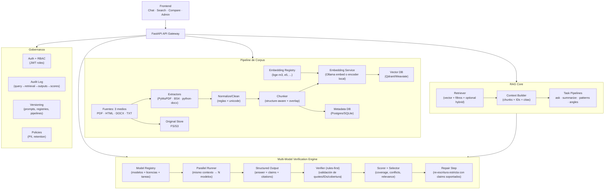

## Arquitectura del Sistema

### Visión general

Este proyecto es una evolución abierta de Tbot_writer- hacia una plataforma de periodismo latinoamericano independiente basada en RAG (Retrieval-Augmented Generation) con:

- búsqueda semántica sobre 3 archivos de medios,
- recuperación con citas exactas,
- resúmenes temáticos, patrones narrativos y sugerencia de ángulos,
- multi-modelo con verificación estricta (Generate → Verify → Repair),
- auditoría reproducible para revisión editorial.

El frontend se conecta siempre a un backend único y completo que orquesta ingesta, retrieval, generación, comparación, verificación y logs.

### Principios de diseño

- Abierto y modular: piezas intercambiables (VectorDB, embeddings, modelos, proveedor de compute).
- Reproducibilidad: entradas/versiones registradas para re-ejecutar y auditar.
- Transparencia editorial: evidencia, citas, discrepancias y scores visibles.
- Fidelidad al corpus: el sistema verifica contra el archivo indexado, no contra la web.

---

### Stack tecnológico (decisiones y ventajas)

#### Lenguaje

- Python 3.11+
- Ventajas: ecosistema maduro para NLP/RAG, buen soporte async, tooling de producción.

#### Backend Framework

- FastAPI (elegido)  
  - Esquemas tipados con Pydantic para respuestas complejas (answer + citations + audit_id + compare).  
  - Async nativo para ejecutar N modelos en paralelo y reducir latencia.  
  - Streaming para chat y resultados multi-modelo.  
  - OpenAPI automático: facilita adopción y contribución en proyecto abierto.
- Flask (alternativa)  
  - Ventaja: minimalista.  
  - Coste: más trabajo para typing, async, streaming y docs.

#### RAG Framework

- LlamaIndex (elegido)  
  - Enfoque data-centric (ingesta → index → retrieval → query).  
  - Mayor control de metadata/evidencia (clave para periodismo).  
  - Pipelines legibles y reproducibles para colaboración open source.
- LangChain (alternativa)  
  - Ventaja: ecosistema enorme para agentes/tools.  
  - Coste: más magia/complejidad si el foco principal es archivo + evidencia.

#### Vector DB

- Qdrant (default MVP)  
  - Excelente soporte de payload/metadata + filtros (medio, fecha, autor, tags).  
  - Operación simple (Docker) y licencia muy compatible con proyectos abiertos.
- Weaviate (alternativa)  
  - Hybrid search (BM25 + vector) muy útil para nombres propios/siglas.  
  - Funcionalidades plataforma (según despliegue) para escalar gobernanza.

#### Embeddings

- BAAI/bge-m3 (default)  
  - Robusto multilingüe y útil para contextos largos; buen baseline.
- intfloat/multilingual-e5-large (challenger)  
  - Muy competitivo en RAG; bueno para evaluación comparativa.

Decisión de arquitectura: soportar un Embedding Registry para comparar embedders sin reescrituras.

#### LLM runtime

- Ollama (local, open-weights friendly)  
  - Facilita correr modelos open-weights con API uniforme.  
  - Permite streaming y despliegues auto-hospedados.  
  - Simplifica el prototipo (un solo runtime para LLM y, opcionalmente, embeddings).

#### Frontend

- Next.js o React  
  - UI conversacional + vistas de evidencia.  
  - Panel de administración y modo comparación A/B/C.

#### Infraestructura

- Auto-hospedado con Docker Compose  
  - Reproducible, portable y coherente con proyecto abierto.  
  - Compatible con múltiples proveedores (servidor propio, Hetzner, DigitalOcean, AWS).

---

### Arquitectura por componentes



---

### Verificación multi-modelo (lo fundamental)

#### Objetivo

Garantizar que la respuesta final sea fiel al corpus (archivo indexado) y que cada afirmación factual esté respaldada por citas exactas.

#### Estrategia: Generate → Verify → Repair

1. Generate (N modelos): se envía el mismo contexto (chunks + metadata) a varios modelos.  
2. Verify (determinista): el verificador valida que cada claim:  
   - cite chunks reales (chunk_id válido),  
   - incluya un quote que exista en el chunk,  
   - tenga cobertura mínima (sin afirmaciones sin evidencia),  
   - detecte conflictos internos (fechas/entidades).  
3. Repair: reescritura estricta: solo incluye claims SUPPORTED; si hay conflicto, lo reporta y presenta ambas evidencias.

#### Formato de salida estructurada (por modelo)

```json
{
  "answer": "...",
  "claims": [
    { "id": "c1", "text": "...", "status": "SUPPORTED|UNSUPPORTED|UNCERTAIN" }
  ],
  "citations": [
    {
      "claim_id": "c1",
      "doc_id": "...",
      "chunk_id": "...",
      "quote": "...",
      "start": 123,
      "end": 210
    }
  ]
}
```

#### Ventajas de esta decisión

- Reduce alucinaciones: la respuesta final se construye desde evidencia.  
- Permite comparación real: se puntúan modelos por cobertura/validez, no por estilo.  
- Produce salidas auditables: cada claim se rastrea a citas.

---

### Endpoints (front siempre al backend completo)

#### Uso normal

- `POST /ask`  
  - RAG + modelo(s) default + verificación + repair.  
  - Devuelve `final_answer`, `citations[]`, `audit_id`, `model_used`.

#### Modo editorial

- `POST /compare`  
  - Ejecuta N modelos con el mismo contexto.  
  - Devuelve `results[]` por modelo + `scores` + `winner` + `final_answer_strict`.

#### Búsqueda y herramientas

- `POST /search` (semantic + filtros)  
- `POST /summarize` (tema → síntesis con citas)  
- `POST /patterns` (patrones narrativos + ejemplos citados)  
- `POST /angles` (sugerencias + evidencia)

#### Admin

- `POST /ingest` (cargar corpus)  
- `POST /reindex` (reconstruir embeddings)  
- `GET /models` (listar registry)  
- `GET /audit/{id}` (reproducir ejecución)

---

### Gobernanza y auditoría (reproducibilidad)

Cada request produce un `audit_id` que guarda:

- query, usuario/rol, filtros,  
- lista exacta de chunks recuperados (`doc_id`/`chunk_id` + hash),  
- prompts (versión),  
- modelos ejecutados + parámetros,  
- outputs por modelo, scores, conflictos,  
- respuesta final (y si hubo repair).

Ventajas:

- Revisión editorial y transparencia.  
- Debugging y mejora continua.  
- Confianza: se puede demostrar de dónde salió una respuesta.

---

### Relación con Tbot_writer-

- El CLI original se conserva como inspiración y se migra a:  
  - API modular  
  - `reference_materials/` → corpus indexado  
  - selección manual de modelo → Model Registry  
  - escritura creativa → RAG periodístico con evidencia y verificación

---

### Estado

Este documento define una arquitectura completa, abierta, modular y auditable, incorporando comparación multi-modelo y verificación estricta orientada a periodismo.